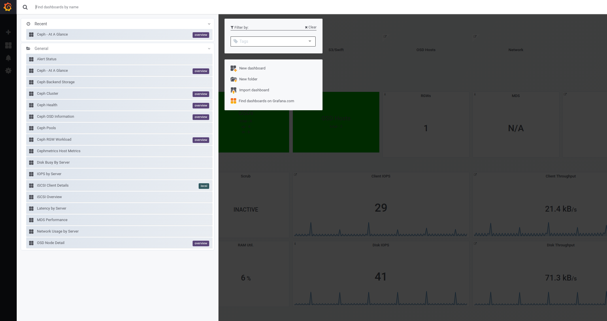
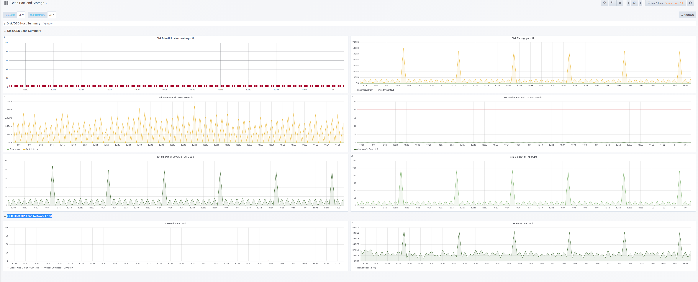

## CONFIGURE DC2 CEPH CLUSTER
***
On our bastion host we have ceph-ansible installed for us, because we are managing both of our ceph clusters from one bastion host, we have one ceph-ansible dir per ceph cluster:

```
[root@bastion ~]# ls -l /root/dc*
/root/dc1:
total 4
drwxr-xr-x. 7 root root 4096 Mar 19 11:35 ceph-ansible

/root/dc2:
total 0
drwxr-xr-x. 7 root root 272 Mar 19 11:35 ceph-ansible
```


We have our dc1 ceph cluster running now we are going to deploy our second cluster, to accomplish this we have to follow the following steps:

Go into our ceph-ansible configuration dir:
```

[root@bastion ceph-ansible]# pwd
/root/dc2/ceph-ansible
```

We have a pre-defined inventory, with our ceph nodes for our cluster in dc2.

Like we have mentioned before we are going to run the mons, mgrs, osds on the 3 ceph nodes ceph1,2,3.
We are also adding our ceph nodes and the bastion host as clients so the ceph-keys get copied to the nodes and we can run ceph commands from the bastion.
Finally we will configure our rados gateway to run on ceph1

```

[root@bastion ~]# cat /root/dc2/ceph-ansible/inventory
[mons]
ceph[1:3]

[mgrs]
ceph[1:3]

[osds]
ceph[1:3]

[clients]
ceph[1:3]
0bastion
metrics4

[ceph-grafana]
metrics4

[rgws]
ceph1
.....
```


Run the following command to test the inventory and that ansible connects ok to all nodes. All nodes in the inventory should respond to the ansible ping module and there should be no errors.

```
[root@bastion ceph-ansible]# ansible -i inventory -m ping all
 [WARNING]: Found both group and host with same name: 0bastion

bastion | SUCCESS => {
    "changed": false,
    "ping": "pong"
}
ceph1 | SUCCESS => {
    "changed": false,
    "ping": "pong"
}
.....
ceph3 | SUCCESS => {
    "changed": false,
    "ping": "pong"
}
```


To configure our cluster using ceph-ansible we work with the variable files in group_vars, These are the files that we have to take in account to configure our dc2 ceph cluster for this lab:

```
[root@bastion ceph-ansible]# ls -l group_vars/ | grep -v sample
total 136
-rw-r--r--. 1 root root  1724 Mar 18 07:19 all.yml
-rw-r--r--. 1 root root  1927 Mar 18 06:38 clients.yml
-rw-r--r--. 1 root root  1558 Mar 18 06:30 mgrs.yml
-rw-r--r--. 1 root root   257 Mar 18 07:19 osds.yml
-rw-r--r--. 1 root root   929 Mar 18 06:55 rgws.yml
```


There are 2 yml files that we have to modify, so we can configure our dc2 cluster as needed:

- osds.yml
- all.yml

>**NOTE**:   Be careful with indentation and only modify the parameters mentioned.  Syntax errors may lead to cluster misconfiguration which could damage the cluster.

First we are going to configure the OSDs. we need to edit the file and do the following modifications, specify lvm as the osd_scenario, there are several scenarios available non-colocated, colocated and lvm, in our case we are going to use lvm:

```

[root@bastion ceph-ansible]# cat group_vars/osds.yml | grep osd_scenario
#valid_osd_scenarios:
osd_scenario: lvm
```


We have the option to create several osds per disk, we are going to configure 1 osd per disk:
```
[root@bastion ceph-ansible]# cat group_vars/osds.yml  | grep osds
osds_per_device: 1
```

Finally we have to specify the devices on out ceph nodes that we want to configure as osds.

We are going to connect to one of our ceph nodes, and check the disks we have available, we should have 2 10GB disks to configure for our OSDS:
```
[root@bastion group_vars]# ssh  cloud-user@ceph1 "lsblk | grep 10G"
vdc                   253:32   0   10G  0 disk
vdd                   253:48   0   10G  0 disk
```
One we now that we have vdc and vdd , we add them your our osds.yml file:
```
[root@bastion group_vars]# cat osds.yml | tail -3
devices:
  - /dev/vdc
  - /dev/vdd
```
Now we can move on to the next vars file that is all.yml, this is the main config file for the cluster, we need to edit the file and make the following modifications.


Change the cluster name, we are going to name are second cluster dc2:

```
[root@bastion group_vars]# cat /root/dc2/ceph-ansible/group_vars/all.yml | grep "cluster:"
cluster: dc2
```
We are going to configure bluestore as our objecstore:
```
[root@bastion group_vars]# cat all.yml | grep -i osd_objectstore
osd_objectstore: bluestore
```
We are going to define the monitor_interface variable to our publick network eth0:
```
[root@bastion group_vars]# cat all.yml | grep  monitor_interface
monitor_interface: eth0
```
Add the public and cluster networks for dc2, if you check in the network schema for our lab we can see that the public network is 172.16.0.0/24 and the private network where ceph replication will happen is 192.168.1.0/24
```
[root@bastion ~]# cat /root/dc2/ceph-ansible/group_vars/all.yml | grep network
#Ceph Cluster network config###
public_network:  172.16.0.0/24
cluster_network: 192.168.1.0/24
```
For the containerized configuration we will use cephs 3 image rhceph-3-rhel7, and we have to configure the register from where we want to download the container image, the registry for dc2 has the IP 172.16.0.10:
```
###Containerized Configuration###
containerized_deployment: true
ceph_docker_image: "rhceph/rhceph-3-rhel7"
ceph_docker_image_tag: "latest"
ceph_docker_registry: "172.16.0.10:5000"
docker_pull_retry: 6
docker_pull_timeout: "600s"
```

Finally, we have to configure on what interface we want to have the rados gateway listening, we configure our public network interface.

```
[root@bastion ~]# cat /root/dc2/ceph-ansible/group_vars/all.yml | grep radosgw_interface
radosgw_interface: eth0
```

With the rest of the files, just to point out some config options

For the ceph mgr daemon, we add the prometheus manager plugin, this is needed to get ceph-metrics working:
```
root@bastion group_vars]# cat mgrs.yml | grep -i ceph_mgr_modules
ceph_mgr_modules: [status,dashboard,prometheus]
```
For the client with copy_admin_key we copy the admin key to the nodes that are included in the clients group of our inventory
```
[root@bastion group_vars]# cat clients.yml | grep admin_key
copy_admin_key: true
```

With all the variables ready we can start the deployment of the ceph cluster, on the root of the ceph-ansible dir /root/dc2/ceph-ansible we need to run the site-docker.yml playbook
```
[root@bastion ceph-ansible]# cd /root/dc2/ceph-ansible
[root@bastion ceph-ansible]# cp site-docker.yml.sample site-docker.yml
[root@bastion ceph-ansible]# ansible-playbook -i inventory site-docker.yml
```
The installation will take aproximatly 10 minutes, if the installation has finished successfully you will see the ansible summary with 0 errors:
```
PLAY RECAP ************************************************************************************************************************************************************************************************************************************
0bastion                   : ok=67   changed=5    unreachable=0    failed=0   
ceph1                      : ok=508  changed=47   unreachable=0    failed=0   
ceph2                      : ok=319  changed=34   unreachable=0    failed=0   
ceph3                      : ok=321  changed=35   unreachable=0    failed=0   
metrics4                   : ok=67   changed=6    unreachable=0    failed=0   
```

With our DC2 cluster installed lets check the status of both of our clusters and briefly overview there configuration.

Becasue we configured the bastion host as a client we should have the ceph admin keys available in /etc/ceph:
```
[root@bastion ~]# ls -l /etc/ceph/
total 20
-rw-------. 1 ceph ceph 159 Mar 19 11:49 dc1.client.admin.keyring
-rw-r--r--. 1 root root 624 Mar 19 11:49 dc1.conf
-rw-------. 1 ceph ceph 159 Mar 21 11:52 dc2.client.admin.keyring
-rw-r--r--. 1 root root 632 Mar 21 11:52 dc2.conf
```

There are 2 ceph .conf files one for each cluster, and also two key-rings one for each cluster, to be able to run ceph commands on each of the clusters we have to use the --cluster option available on ceph cli commands, for example:


For our DC1 cluster:
```
[root@bastion ~]# ceph --cluster dc1 status
  cluster:
    id:     04e97e50-521d-4a25-8e46-dc9cc66fc7e2
    health: HEALTH_WARN
            too few PGs per OSD (16 < min 30)

  services:
    mon: 3 daemons, quorum cepha,cephb,cephc
    mgr: cephc(active), standbys: cepha
    osd: 6 osds: 6 up, 6 in
    rgw: 1 daemon active

  data:
    pools:   4 pools, 32 pgs
    objects: 219 objects, 1.09KiB
    usage:   6.05GiB used, 53.9GiB / 60.0GiB avail
    pgs:     32 active+clean

And for DC2 cluster:

[root@bastion ~]# ceph --cluster dc2 status
  cluster:
    id:     04e97e50-521d-4a25-8e46-dc9cc66fc7e2
    health: HEALTH_WARN
            too few PGs per OSD (16 < min 30)

  services:
    mon: 3 daemons, quorum ceph1,ceph2,ceph3
    mgr: ceph2(active), standbys: ceph1, ceph3
    osd: 6 osds: 6 up, 6 in
    rgw: 1 daemon active

  data:
    pools:   4 pools, 32 pgs
    objects: 219 objects, 1.09KiB
    usage:   6.03GiB used, 53.9GiB / 60.0GiB avail
    pgs:     32 active+clean
```

Information that we get from the status , command we can see that the cluster global heath is ok, in the services section we can see that we have 3 mons running on ceph1,ceph2,ceph3, and active manager currently running on ceph2 with 2 stanby nodes ceph1,ceph2 in case ceph2 fails. we have 6 osds, 2 osds per node(disks vdc,vdd), all the the 6 osds are up and in, we also have 1 rados gateway daemon running, finally on the data section we can see that 3 have 3 pools created, these 3 pools have a total 32 pgs used, we can see the current cluster usage at the moment 6GB out the 60gb we have available(each osd has 10gb, 2 osds per 3 nodes gives us our 60gb), and the 32 pgs are in active-clean state.


So with just one command we have a summary of our cluster state, we can dig a little bit deeper, for examle lets check what pools we have in the cluster and how much space they are using

We have 4 pools created on the installation by radosgw, the pools are replicated and the size is 3, which means that for each object that we write is replicated 2 times, so in total we will have 3 copies of the object.

```
[root@bastion ~]# ceph --cluster dc2  osd pool ls detail
pool 1 '.rgw.root' replicated size 3 min_size 2 crush_rule 0 object_hash rjenkins pg_num 8 pgp_num 8 last_change 13 owner 18446744073709551615 flags hashpspool stripe_width 0 application rgw
pool 2 'default.rgw.control' replicated size 3 min_size 2 crush_rule 0 object_hash rjenkins pg_num 8 pgp_num 8 last_change 16 owner 18446744073709551615 flags hashpspool stripe_width 0 application rgw
pool 3 'default.rgw.meta' replicated size 3 min_size 2 crush_rule 0 object_hash rjenkins pg_num 8 pgp_num 8 last_change 18 owner 18446744073709551615 flags hashpspool stripe_width 0 application rgw
pool 4 'default.rgw.log' replicated size 3 min_size 2 crush_rule 0 object_hash rjenkins pg_num 8 pgp_num 8 last_change 20 owner 18446744073709551615 flags hashpspool stripe_width 0 application rgw
```
How much space are they using, we can use the df command to get a summary of space usage per pool in the cluster:
```
[root@bastion ~]# ceph --cluster dc2  df
GLOBAL:
    SIZE        AVAIL       RAW USED     %RAW USED
    60.0GiB     53.9GiB      6.03GiB         10.06
POOLS:
    NAME                    ID     USED        %USED     MAX AVAIL     OBJECTS
    .rgw.root               1      1.09KiB         0       17.0GiB           4
    default.rgw.control     2           0B         0       17.0GiB           8
    default.rgw.meta        3           0B         0       17.0GiB           0
    default.rgw.log         4           0B         0       17.0GiB         207
```
We can check our osd cluster tree, were we can see that we have 2 osds under each host, with the default configuration each host is our failure domain, so ceph when doing the replication of the objects after a write will take care of replicating one copy of the object to and osd under each node.
```
[root@bastion ~]# ceph --cluster dc2 osd tree
ID CLASS WEIGHT  TYPE NAME      STATUS REWEIGHT PRI-AFF
-1       0.05878 root default                           
-5       0.01959     host ceph1                         
 0   hdd 0.00980         osd.0      up  1.00000 1.00000
 3   hdd 0.00980         osd.3      up  1.00000 1.00000
-7       0.01959     host ceph2                         
 2   hdd 0.00980         osd.2      up  1.00000 1.00000
 5   hdd 0.00980         osd.5      up  1.00000 1.00000
-3       0.01959     host ceph3                         
 1   hdd 0.00980         osd.1      up  1.00000 1.00000
 4   hdd 0.00980         osd.4      up  1.00000 1.00000
```
There is also the osd status command where we can see the status of the osds, disk usage per osd, and read/write ops taken place when the command is run.
[root@bastion ~]# ceph --cluster dc2 osd status
```
+----+-------------------------+-------+-------+--------+---------+--------+---------+-----------+
| id |           host          |  used | avail | wr ops | wr data | rd ops | rd data |   state   |
+----+-------------------------+-------+-------+--------+---------+--------+---------+-----------+
| 0  | ceph1.rhpds.opentlc.com | 1029M | 9206M |    0   |     0   |    0   |     0   | exists,up |
| 1  | ceph3.rhpds.opentlc.com | 1029M | 9206M |    0   |     0   |    0   |     0   | exists,up |
| 2  | ceph2.rhpds.opentlc.com | 1029M | 9206M |    0   |     0   |    0   |     0   | exists,up |
| 3  | ceph1.rhpds.opentlc.com | 1029M | 9206M |    0   |     0   |    0   |     0   | exists,up |
| 4  | ceph3.rhpds.opentlc.com | 1029M | 9206M |    0   |     0   |    0   |     0   | exists,up |
| 5  | ceph2.rhpds.opentlc.com | 1029M | 9206M |    0   |     0   |    0   |     0   | exists,up |
+----+-------------------------+-------+-------+--------+---------+--------+---------+-----------+
```
So once we have checked that both clusters are healthy and ready to be used, let's start with the configuration of our rgw multisite .


## RADOS GATEWAY configuration
***

All RadosGW services SHOULD BE STOPPED before following this procedure to create realms, zonegroups and zones:
	-More info can be found here: https://access.redhat.com/documentation/en-us/red_hat_ceph_storage/3/html/object_gateway_guide_for_red_hat_enterprise_linux/multi_site

From the bastion host we can check that the rados gateway containers are running on ceph1 and cepha
```
[root@bastion ~]# ansible -b -m shell -a "docker ps | grep rgw" ceph1,cepha
cepha | SUCCESS | rc=0 >>
883549d1226c        10.0.0.10:5000/rhceph/rhceph-3-rhel7:latest   "/entrypoint.sh"    4 hours ago         Up 4 hours                              ceph-rgw-cepha

ceph1 | SUCCESS | rc=0 >>
dcd14c2e0b54        172.16.0.10:5000/rhceph/rhceph-3-rhel7:latest   "/entrypoint.sh"    4 hours ago         Up 4 hours                              ceph-rgw-ceph1
```

We are going to use the systemd uni to stop the rados gw container
```
[root@bastion ~]#  ansible -b -m shell -a "systemctl stop ceph-radosgw@rgw.ceph*" ceph1,cepha
cepha | SUCCESS | rc=0 >>


ceph1 | SUCCESS | rc=0 >>

```
And finally a double check so we are sure our containers are stopped.

```
[root@bastion ~]# ansible -b -m shell -a "docker ps | grep rgw" ceph1,cepha
cepha | FAILED | rc=1 >>
non-zero return code

ceph1 | FAILED | rc=1 >>
non-zero return code
```


We have to do some modifications on the ceph.conf of all the RGW nodes so we can specify the zone for each rados gateway daemon.
We are going to make use of ceph-ansible to implement these changes:

 Edit the all.yml file in Ceph-ansible node for DC1:
 ```
# vim /root/dc1/ceph-ansible/group_vars/all.yml
```
And add the following to the override section:
```
  client.rgw.cepha:
    host: cepha
    keyring: /var/lib/ceph/radosgw/ceph-rgw.cepha/keyring
    log file: /var/log/ceph/ceph-rgw-cepha.log
    rgw frontends: civetweb port=10.0.0.11:8080 num_threads=1024
    rgw_dynamic_resharding: false
    debug_civetweb: "0/1"
    rgw_enable_apis: s3,admin
    rgw_zone: dc1
    rgw_thread_pool_size: 1024
```
```
# vim /root/dc1/ceph-ansible/group_vars/rgws.yml
```
```
ceph_rgw_docker_extra_env: "-e RGW_ZONE=dc1 -e RGW_ZONEGROUP=production"
```

Once modified we have to run the site-docker playbook again for DC1:
```
# cd /root/dc1/ceph-ansible/
# ansible-playbook site-docker.yml
```

We have to follow the same steps on our second cluster in DC2:
```
# vim /root/dc2/ceph-ansible/group_vars/all.yml
  client.rgw.ceph1:
    host: ceph1
    keyring: /var/lib/ceph/radosgw/ceph-rgw.ceph1/keyring
    log file: /var/log/ceph/ceph-rgw-ceph1.log
    rgw frontends: civetweb port=172.16.0.11:8080 num_threads=1024
    rgw_dynamic_resharding: false
    debug_civetweb: "0/1"
    rgw_enable_apis: s3,admin
    rgw_zone: dc2
    rgw_thread_pool_size: 1024
```
```
# vim /root/dc2/ceph-ansible/group_vars/rgws.yml
ceph_rgw_docker_extra_env: "-e RGW_ZONE=dc2 -e RGW_ZONEGROUP=production"
```

```
#cd /root/dc2/ceph-ansible/
#ansible-playbook site-docker.yml
```


## Rados Gateway Multisite Configuration
***

A single zone configuration typically consists of one zone group containing one zone and one or more ceph-radosgw instances where you may load-balance gateway client requests between the instances. In a single zone configuration, typically multiple gateway instances point to a single Ceph storage cluster.

In this lab we are going to deploy an advanced configuration that consists of one zone group and two zones, each zone with one(could be more) ceph-radosgw instances. Each zone is backed by its own Ceph Storage Cluster. Multiple zones in a zone group provides disaster recovery for the zone group should one of the zones experience a significant failure, Each zone is active and may receive write operations.

Prepare multi-site environment:

```
REALM="summitlab"
ZONEGROUP="production"
MASTER_ZONE="dc1"
SECONDARY_ZONE="dc2"
ENDPOINTS_MASTER_ZONE="http://cepha:8080"
URL_MASTER_ZONE="http://cepha:8080"
ENDPOINTS_SECONDARY_ZONE="http://ceph1:8080"
URL_SECONDARY_ZONE="http://ceph1:8080"
SYNC_USER="sync-user"
ACCESS_KEY="redhat"
SECRET_KEY="redhat"
```
Master zone: Execute the following commands in the RGW node of DC1 (ceph1)

Create the realm:
```
	# radosgw-admin --cluster dc1 realm create --rgw-realm=${REALM} --default
  ```
Create the zonegroup with the RGW replication endpoints of the master zone:
```
	# radosgw-admin --cluster dc1 zonegroup create --rgw-zonegroup=${ZONEGROUP} --endpoints=${ENDPOINTS_MASTER_ZONE} --rgw-realm=${REALM} --master --default
```  
Create the zonegroup with the RGW replication endpoints of the master zone(cepha):
```
	# radosgw-admin --cluster dc1 zone create --rgw-zonegroup=${ZONEGROUP} --rgw-zone=${MASTER_ZONE} --endpoints=${ENDPOINTS_MASTER_ZONE} --master --default
```

#####

A realm contains the multi-site configuration of zone groups and zones and also serves to enforce a globally unique namespace within the realm.
```
[root@bastion ceph-ansible]# radosgw-admin --cluster dc1 realm create --rgw-realm=${REALM} --default
{
    "id": "81fb554d-079c-4047-8387-f68d16564cc3",
    "name": "summitlab",
    "current_period": "a188d0d3-cfe9-45e2-97c9-604d9d21221b",
    "epoch": 1
}
```
A realm must have at least one zone group, which will serve as the master zone group for the realm.
```
[root@bastion ceph-ansible]# radosgw-admin --cluster dc1 zonegroup create --rgw-zonegroup=${ZONEGROUP} --endpoints=${ENDPOINTS_MASTER_ZONE} --rgw-realm=${REALM} --master --default
{
    "id": "00ba3e86-1207-49ba-9df6-cd2a8a07de2a",
    "name": "production",
    "api_name": "production",
    "is_master": "true",
    "endpoints": [
        "http://cepha:8080"
    ],
    "hostnames": [],
    "hostnames_s3website": [],
    "master_zone": "",
    "zones": [],
    "placement_targets": [],
    "default_placement": "",
    "realm_id": "81fb554d-079c-4047-8387-f68d16564cc3"
}
```
Create a master zone for the multi-site configuration by opening a command line interface on a host identified to serve in the master zone group and zone. Then, execute the following:

```
[root@bastion ceph-ansible]# radosgw-admin --cluster dc1 zone create --rgw-zonegroup=${ZONEGROUP} --rgw-zone=${MASTER_ZONE} --endpoints=${ENDPOINTS_MASTER_ZONE} --master --default
{
    "id": "6d1a4a77-75bb-45ca-8088-05d6e7d3e223",
    "name": "dc1",
    "domain_root": "dc1.rgw.meta:root",
    "control_pool": "dc1.rgw.control",
    "gc_pool": "dc1.rgw.log:gc",
    "lc_pool": "dc1.rgw.log:lc",
    "log_pool": "dc1.rgw.log",
    "intent_log_pool": "dc1.rgw.log:intent",
    "usage_log_pool": "dc1.rgw.log:usage",
    "reshard_pool": "dc1.rgw.log:reshard",
    "user_keys_pool": "dc1.rgw.meta:users.keys",
    "user_email_pool": "dc1.rgw.meta:users.email",
    "user_swift_pool": "dc1.rgw.meta:users.swift",
    "user_uid_pool": "dc1.rgw.meta:users.uid",
    "system_key": {
        "access_key": "",
        "secret_key": ""
    },
    "placement_pools": [
        {
            "key": "default-placement",
            "val": {
                "index_pool": "dc1.rgw.buckets.index",
                "data_pool": "dc1.rgw.buckets.data",
                "data_extra_pool": "dc1.rgw.buckets.non-ec",
                "index_type": 0,
                "compression": ""
            }
        }
    ],
    "metadata_heap": "",
    "tier_config": [],
    "realm_id": "81fb554d-079c-4047-8387-f68d16564cc3"
}
```


####


Create the sync user. Save the ACCESS_KEY and SECRET_KEY values from this command:
```
# radosgw-admin --cluster dc1 user create --uid=${SYNC_USER} --display-name="Synchronization User" --access-key=${ACCESS_KEY} --secret=${SECRET_KEY} --system"
```
Assign the user to the master zone:
```
# radosgw-admin --cluster dc1 zone modify --rgw-zone=${MASTER_ZONE} --access-key=${ACCESS_KEY} --secret=${SECRET_KEY}
```
Update the period:
```
# radosgw-admin --cluster dc1 period update --commit
```
Start radosgw --cluster dc1 service in the master zone nodes:
```
cepha # systemctl enable ceph-radosgw@rgw.$(hostname -s) --now
```
```
[root@bastion ceph-ansible]# radosgw-admin --cluster dc1 user create --uid=${SYNC_USER} --display-name="Synchronization User" --access-key=${ACCESS_KEY} --secret=${SECRET_KEY} --system
{
    "user_id": "sync-user",
    "display_name": "Synchronization User",
    "email": "",
    "suspended": 0,
    "max_buckets": 1000,
    "auid": 0,
    "subusers": [],
    "keys": [
        {
            "user": "sync-user",
            "access_key": "redhat",
            "secret_key": "redhat"
        }
    ],
    "swift_keys": [],
    "caps": [],
    "op_mask": "read, write, delete",
    "system": "true",
    "default_placement": "",
    "placement_tags": [],
    "bucket_quota": {
        "enabled": false,
        "check_on_raw": false,
        "max_size": -1,
        "max_size_kb": 0,
        "max_objects": -1
    },
    "user_quota": {
        "enabled": false,
        "check_on_raw": false,
        "max_size": -1,
        "max_size_kb": 0,
        "max_objects": -1
    },
    "temp_url_keys": [],
    "type": "rgw"
}
```
```
[root@bastion ceph-ansible]#  radosgw-admin --cluster dc1 zone modify --rgw-zone=${MASTER_ZONE} --access-key=${ACCESS_KEY} --secret=${SECRET_KEY}
{
    "id": "6d1a4a77-75bb-45ca-8088-05d6e7d3e223",
    "name": "dc1",
    "domain_root": "dc1.rgw.meta:root",
    "control_pool": "dc1.rgw.control",
    "gc_pool": "dc1.rgw.log:gc",
    "lc_pool": "dc1.rgw.log:lc",
    "log_pool": "dc1.rgw.log",
    "intent_log_pool": "dc1.rgw.log:intent",
    "usage_log_pool": "dc1.rgw.log:usage",
    "reshard_pool": "dc1.rgw.log:reshard",
    "user_keys_pool": "dc1.rgw.meta:users.keys",
    "user_email_pool": "dc1.rgw.meta:users.email",
    "user_swift_pool": "dc1.rgw.meta:users.swift",
    "user_uid_pool": "dc1.rgw.meta:users.uid",
    "system_key": {
        "access_key": "redhat",
        "secret_key": "redhat"
    },
    "placement_pools": [
        {
            "key": "default-placement",
            "val": {
                "index_pool": "dc1.rgw.buckets.index",
                "data_pool": "dc1.rgw.buckets.data",
                "data_extra_pool": "dc1.rgw.buckets.non-ec",
                "index_type": 0,
                "compression": ""
            }
        }
    ],
    "metadata_heap": "",
    "tier_config": [],
    "realm_id": "81fb554d-079c-4047-8387-f68d16564cc3"
}
```
```
[root@bastion ceph-ansible]# radosgw-admin --cluster dc1 period update --commit
{
    "id": "9615afd8-819a-48bf-b309-66e79f874c8f",
    "epoch": 1,
    "predecessor_uuid": "a188d0d3-cfe9-45e2-97c9-604d9d21221b",
    "sync_status": [],
    "period_map": {
        "id": "9615afd8-819a-48bf-b309-66e79f874c8f",
        "zonegroups": [
            {
                "id": "00ba3e86-1207-49ba-9df6-cd2a8a07de2a",
                "name": "production",
                "api_name": "production",
                "is_master": "true",
                "endpoints": [
                    "http://cepha:8080"
                ],
                "hostnames": [],
                "hostnames_s3website": [],
                "master_zone": "6d1a4a77-75bb-45ca-8088-05d6e7d3e223",
                "zones": [
                    {
                        "id": "6d1a4a77-75bb-45ca-8088-05d6e7d3e223",
                        "name": "dc1",
                        "endpoints": [
                            "http://cepha:8080"
                        ],
                        "log_meta": "false",
                        "log_data": "false",
                        "bucket_index_max_shards": 0,
                        "read_only": "false",
                        "tier_type": "",
                        "sync_from_all": "true",
                        "sync_from": []
                    }
                ],
                "placement_targets": [
                    {
                        "name": "default-placement",
                        "tags": []
                    }
                ],
                "default_placement": "default-placement",
                "realm_id": "81fb554d-079c-4047-8387-f68d16564cc3"
            }
        ],
        "short_zone_ids": [
            {
                "key": "6d1a4a77-75bb-45ca-8088-05d6e7d3e223",
                "val": 3389843235
            }
        ]
    },
    "master_zonegroup": "00ba3e86-1207-49ba-9df6-cd2a8a07de2a",
    "master_zone": "6d1a4a77-75bb-45ca-8088-05d6e7d3e223",
    "period_config": {
        "bucket_quota": {
            "enabled": false,
            "check_on_raw": false,
            "max_size": -1,
            "max_size_kb": 0,
            "max_objects": -1
        },
        "user_quota": {
            "enabled": false,
            "check_on_raw": false,
            "max_size": -1,
            "max_size_kb": 0,
            "max_objects": -1
        }
    },
    "realm_id": "81fb554d-079c-4047-8387-f68d16564cc3",
    "realm_name": "summitlab",
    "realm_epoch": 2
}
```

```
[root@bastion ceph-ansible]# ansible -b -m shell -a "systemctl enable ceph-radosgw@rgw.* --now" cepha
cepha | SUCCESS | rc=0 >>
Created symlink from /etc/systemd/system/multi-user.target.wants/ceph-radosgw@rgw.bastion.service to /etc/systemd/system/ceph-radosgw@.service.
```
We can check with ceph status if the radosgw service is running:

```
[root@bastion ~]# ceph --cluster dc1 -s | grep rgw
    rgw: 1 daemon active
```
And also a quick check with curl so we can verify we can access port 8080 provided by the RGW service:
```
[root@bastion ~]# curl http://cepha:8080
<?xml version="1.0" encoding="UTF-8"?><ListAllMyBucketsResult xmlns="http://s3.amazonaws.com/doc/2006-03-01/"><Owner><ID>anonymous</ID><DisplayName></DisplayName></Owner><Buckets></Buckets></ListAllMyBucketsResult>
```

###### Check here with s3cmd client all is ok ? what checks can we do??


With these basic checks we can move forward and configure our DC2 ceph cluster as the slave zone in our zone-group


Secondary zone: Execute the following commands in the RGW node of DC2 (ceph1)


Pull the realm information:
```
# radosgw-admin --cluster dc2 realm pull --url=${URL_MASTER_ZONE} --access-key=${ACCESS_KEY} --secret=${SECRET_KEY} --rgw-realm=${REALM}
```
Set the realm as the default one:
```
# radosgw-admin --cluster dc2 realm default --rgw-realm=${REALM}
```
Pull the period information:
```
# radosgw-admin --cluster dc2 period pull --url=${URL_MASTER_ZONE} --access-key=${ACCESS_KEY} --secret=${SECRET_KEY}
```
Create the secondary zone:
```
# radosgw-admin --cluster dc2 zone create --rgw-zonegroup=${ZONEGROUP} --rgw-zone=${SECONDARY_ZONE} --endpoints=${ENDPOINTS_SECONDARY_ZONE} --access-key=${ACCESS_KEY} --secret=${SECRET_KEY}
```
Update the period:
```
# radosgw-admin --cluster dc2 period update --commit
```
Start radosgw service in the secondary zone nodes:
```
ceph1 # systemctl enable ceph-radosgw@rgw.$(hostname -s) --now
```

Once we have finished the configuration of our second zone, we can check the sync status between zone dc1 and zone dc2

```
[root@bastion ceph-ansible]# radosgw-admin  --cluster dc1 sync status
          realm 80827d79-3fce-4b55-9e73-8c67ceab4f73 (summitlab)
      zonegroup 88222e12-006a-4cac-a5ab-03925365d817 (production)
           zone 602f21ea-7664-4662-bad8-0c3840bb1d7a (dc1)
  metadata sync no sync (zone is master)
      data sync source: ed9f1807-7bc8-48c0-b82f-0fa1511ba47b (dc2)
                        syncing
                        full sync: 0/128 shards
                        incremental sync: 128/128 shards
                        data is caught up with source
[root@bastion ceph-ansible]# radosgw-admin  --cluster dc2 sync status
          realm 80827d79-3fce-4b55-9e73-8c67ceab4f73 (summitlab)
      zonegroup 88222e12-006a-4cac-a5ab-03925365d817 (production)
           zone ed9f1807-7bc8-48c0-b82f-0fa1511ba47b (dc2)
  metadata sync syncing
                full sync: 0/64 shards
                incremental sync: 64/64 shards
                metadata is caught up with master
      data sync source: 602f21ea-7664-4662-bad8-0c3840bb1d7a (dc1)
                        syncing
                        full sync: 0/128 shards
                        incremental sync: 128/128 shards
                        data is caught up with source
```

Lets clean-up the default rados gateway installation, by default when ever a rados gateway daemon starts it will configure and use a default zone and zonegroup, to avoid confusions it's always better to delete our default zone and zonegroups in both clusters.

Once RadosGW services are working with the new values, delete default values for zonegroup and zone in the master zone:
```
		# radosgw-admin --cluster dc1 zonegroup remove --rgw-zonegroup=default --rgw-zone=default
		# radosgw-admin --cluster dc1 period update --commit
		# radosgw-admin --cluster dc1 zone delete --rgw-zone=default
		# radosgw-admin --cluster dc1 period update --commit
		# radosgw-admin --cluster dc2 zone delete --rgw-zone=default
		# radosgw-admin --cluster dc2 period update --commit
		# radosgw-admin --cluster dc1 zonegroup delete --rgw-zonegroup=default
		# radosgw-admin --cluster dc1 period update --commit
		# radosgw-admin --cluster dc2 zonegroup delete --rgw-zonegroup=default
		# radosgw-admin --cluster dc2 period update --commit
```

In both cluster, delete default pools. DISCLAIMER: Data will be unaccessible after performing this operation:

```
[root@bastion red-hat-ceph-storage-building-an-object-storage-active-active-multisite-solution]# for pool in $(rados --cluster dc1 lspools | grep ^default);do ceph --cluster dc1  osd pool delete ${pool} ${pool} --yes-i-really-really-mean-it;done
pool 'default.rgw.control' removed
pool 'default.rgw.meta' removed
pool 'default.rgw.log' removed
```
```
[root@bastion red-hat-ceph-storage-building-an-object-storage-active-active-multisite-solution]# for pool in $(rados --cluster dc2 lspools | grep ^default);do ceph --cluster dc1  osd pool delete ${pool} ${pool} --yes-i-really-really-mean-it;done
pool 'default.rgw.control' does not exist
pool 'default.rgw.meta' does not exist
pool 'default.rgw.log' does not exist
```

Now that our cluster is ready and we have cleaned up the default rgw pools, let's test our cluster uploading some objects.

First we need to create a rgw user, we have to save the access and secret key from the output.

```
[root@bastion red-hat-ceph-storage-building-an-object-storage-active-active-multisite-solution]# radosgw-admin --cluster dc1 user create --uid="summit19" --display-name="Redhat Summit User"
{
    "user_id": "summit19",
    "display_name": "Redhat Summit User",
    "email": "",
    "suspended": 0,
    "max_buckets": 1000,
    "auid": 0,
    "subusers": [],
    "keys": [
        {
            "user": "summit19",
            "access_key": "ZHFNL7J6CJCZRZ0VSVO5",
            "secret_key": "SJ15woJx8hnAz2mNGV78oUPSC3gliowojbOPf2Tb"
        }
    ],
    "swift_keys": [],
    "caps": [],
    "op_mask": "read, write, delete",
    "default_placement": "",
    "placement_tags": [],
    "bucket_quota": {
        "enabled": false,
        "check_on_raw": false,
        "max_size": -1,
        "max_size_kb": 0,
        "max_objects": -1
    },
        "enabled": false,
        "check_on_raw": false,
        "max_size": -1,
        "max_size_kb": 0,
        "max_objects": -1
    },
    "temp_url_keys": [],
    "user_quota": {
    "type": "rgw"
}
```

Lets check that our summit19 is present in our master zone dc1:

```
[root@bastion red-hat-ceph-storage-building-an-object-storage-active-active-multisite-solution]# radosgw-admin --cluster dc1 user list
[
    "summit19",
    "sync-user"
]


if we wait for both clusters to sync the metadata we can see that the rgw user is also present on cluster dc2:

[root@bastion red-hat-ceph-storage-building-an-object-storage-active-active-multisite-solution]# radosgw-admin --cluster dc2 user list
[
    "summit19",
    "sync-user"
]
```

We are now going to configure and S3 client so we can upload objects to our rgw cluster, for this lab we are going to be using a cli tool called s3cmd, s3cmd is allready pre-installed on the bastion host:

```
[root@bastion ~]# yum list installed | grep -i s3cmd
s3cmd.noarch                  2.0.2-1.el7             installed                 
```

Lets run the s3cmd command with the configure parameter so we can do a bootstrap config of our s3 client, we are going to first create the configuration for the dc1 zone:

Please fill in the requested data by the application, we use the Access Key and the Secret key from the summit19 user that we created previously, and use cepha:8080 as the S3 endpoint:


here is and example-

```
[root@bastion ~]# s3cmd --configure

Enter new values or accept defaults in brackets with Enter.
Refer to user manual for detailed description of all options.

Access key and Secret key are your identifiers for Amazon S3. Leave them empty for using the env variables.
Access Key: ZHFNL7J6CJCZRZ0VSVO5
Secret Key: SJ15woJx8hnAz2mNGV78oUPSC3gliowojbOPf2Tb
Default Region [US]: US

Use "s3.amazonaws.com" for S3 Endpoint and not modify it to the target Amazon S3.
S3 Endpoint [s3.amazonaws.com]: cepha:8080                    

Use "%(bucket)s.s3.amazonaws.com" to the target Amazon S3. "%(bucket)s" and "%(location)s" vars can be used
if the target S3 system supports dns based buckets.
DNS-style bucket+hostname:port template for accessing a bucket [%(bucket)s.s3.amazonaws.com]: cepha:8080

Encryption password is used to protect your files from reading
by unauthorized persons while in transfer to S3
Encryption password:
Path to GPG program [/bin/gpg]: /usr/bin/gpg

When using secure HTTPS protocol all communication with Amazon S3
servers is protected from 3rd party eavesdropping. This method is
slower than plain HTTP, and can only be proxied with Python 2.7 or newer
Use HTTPS protocol [Yes]: No

On some networks all internet access must go through a HTTP proxy.
Try setting it here if you can't connect to S3 directly
HTTP Proxy server name:

New settings:
  Access Key: ZHFNL7J6CJCZRZ0VSVO5
  Secret Key: SJ15woJx8hnAz2mNGV78oUPSC3gliowojbOPf2Tb
  Default Region: US
  S3 Endpoint: cepha:8080
  DNS-style bucket+hostname:port template for accessing a bucket: cepha:8080
  Encryption password:
  Path to GPG program: /usr/bin/gpg
  Use HTTPS protocol: False
  HTTP Proxy server name:
  HTTP Proxy server port: 0

Test access with supplied credentials? [Y/n] Y
Please wait, attempting to list all buckets...
Success. Your access key and secret key worked fine :-)

Now verifying that encryption works...
Not configured. Never mind.

Save settings? [y/N] y
Configuration saved to '/root/.s3cfg'
```

As you can see the configuration for the client has been saved to the following path /root/.s3cfg , lets change the name of the config file to /root/s3-dc1.cfg

```
[root@bastion ~]#mv /root/.s3cfg /root/s3-dc1.cfg   
```  

let's create a first bucket using the s3cmd mb command, because are not using the default location for the config file of /root/.s3cfg. we need to specify with -c ~/s3-dc1.cfg the location of our s3cmd config:

```
[root@bastion ~]# s3cmd -c ~/s3-dc1.cfg mb s3://my-first-bucket
Bucket 's3://my-first-bucket/' created

[root@bastion ~]# s3cmd -c ~/s3-dc1.cfg ls
2019-03-24 17:49  s3://my-first-bucket
```

Let's upload a file, we are going to use the s3cmd RPM as an example:

```
[root@bastion ~]# ls
anaconda-ks.cfg  ansible  ceph-ansible-keys  dc1  dc2  original-ks.cfg  red-hat-ceph-storage-building-an-object-storage-active-active-multisite-solution  s3cmd-2.0.2-1.el7.noarch.rpm  sync-repos.sh

[root@bastion ~]# s3cmd -c ~/s3-dc1.cfg put s3cmd-2.0.2-1.el7.noarch.rpm s3://my-first-bucket/
upload: 's3cmd-2.0.2-1.el7.noarch.rpm' -> 's3://my-first-bucket/s3cmd-2.0.2-1.el7.noarch.rpm'  [1 of 1]
 194693 of 194693   100% in    2s    85.00 kB/s  done
```

With s3cmd la we can check all the objects in the bucket

```
[root@bastion ~]# s3cmd -c ~/s3-dc1.cfg la
2019-03-24 17:52    194693   s3://my-first-bucket/s3cmd-2.0.2-1.el7.noarch.rpm
```
And with the du option we can see the disk used by each object:
```
[root@bastion ~]# s3cmd -c ~/s3-dc1.cfg du
194693   1 objects s3://my-first-bucket/
--------
194693   Total
```

If we run the sync status command after running a put of a large object we would be able to see the secondary cluster doing a sync to keep up with the master

```
[root@bastion ~]# radosgw-admin  --cluster dc2 sync status
          realm 80827d79-3fce-4b55-9e73-8c67ceab4f73 (summitlab)
      zonegroup 88222e12-006a-4cac-a5ab-03925365d817 (production)
           zone ed9f1807-7bc8-48c0-b82f-0fa1511ba47b (dc2)
  metadata sync syncing
                full sync: 0/64 shards
                incremental sync: 64/64 shards
                metadata is caught up with master
      data sync source: 602f21ea-7664-4662-bad8-0c3840bb1d7a (dc1)
                        syncing
                        full sync: 0/128 shards
                        incremental sync: 128/128 shards
                        1 shards are recovering
                        recovering shards: [22]

```

We can also check that the replication is working by connecting to the second zone dc2 and checking that the bucket and the file we uploaded are present on DC2

```
[root@bastion ~]# radosgw-admin --cluster dc2 bucket list
[
    "my-first-bucket"
]
```

Our bucket has been created lets take a look at the objects inside the DC data pool


```
[root@bastion ~]#  rados --cluster dc2  -p dc2.rgw.buckets.data ls
602f21ea-7664-4662-bad8-0c3840bb1d7a.314154.1_s3cmd-2.0.2-1.el7.noarch.rpm
```

As we explained in the introduction RGW can be use as an active/active object storage Multisite solution, lets double check we can also put objects into our second zone DC2.

First we need to create a config file that is pointing to the endpoints of DC(ceph1:8080), we are going to use sed to create a new file from our current DC1 s3cmd configuration file, we only need to replace the endpoint from cepha to ceph1, there is no need to use a different user, all the metadata, including users is replicated between both sites.
```
[root@bastion ~]# sed 's/cepha/ceph1/g' /root/s3-dc1.cfg > /root/s3-dc2.cfg
[root@bastion ~]# s3cmd -c ~/s3-dc2.cfg  ls
2019-03-24 17:49  s3://my-first-bucket
```
We can create a bucket in dc2 and store a file

```
[root@bastion ~]# s3cmd -c ~/s3-dc2.cfg  mb  s3://my-second-bucket
Bucket 's3://my-second-bucket/' created
[root@bastion ~]# s3cmd -c ~/s3-dc2.cfg  put /var/log/messages  s3://my-second-bucket
upload: '/var/log/messages' -> 's3://my-second-bucket/messages'  [1 of 1]
 181085 of 181085   100% in    0s    10.22 MB/s  done
 ```

 The file is also accessible from zone DC1, our active/active multisite cluster is working without issues.

 ```
[root@bastion ~]# s3cmd -c ~/s3-dc1.cfg  ls  s3://my-second-bucket
2019-03-25 08:20    181085   s3://my-second-bucket/messages
```

## Installing Ceph-metrics in DC2 ceph cluster.


We need to connect to our metrics virtual machine it's hostname is metrics4

```
[root@bastion ~]# ssh cloud-user@metrics4
Warning: Permanently added 'metrics4,172.16.0.14' (ECDSA) to the list of known hosts.
Last login: Fri Mar 22 18:49:10 2019 from 172.16.0.10
[cloud-user@metrics4 ~]$ sudo -i
```

We have cephmetrics-ansible already pre-installed on the system, lets check

```
[root@metrics4 ~]# yum list installed | grep -i cephmetrics
cephmetrics-ansible.x86_64       2.0.2-1.el7cp               @rhel-7-server-rhceph-3-tools-rpms

```

The ansible playbooks are stored in /usr/share/cephmetrics-ansible/

```
[root@metrics4 ~]# cd /usr/share/cephmetrics-ansible/
[root@metrics4 cephmetrics-ansible]# ls
ansible.cfg  group_vars  inventory  inventory.sample  playbook.yml  purge.yml  README.md  roles
```

Lets check the all.yml group_vars variable file, here we can specify the name of the cluster, if we want to do a containerized deployment, were is our registry and also specify the grafana users to access the metrics dashboard.

To try and save some time, the inventory and the variables have already been pre-configured for you.

```
[root@metrics4 cephmetrics-ansible]# cat group_vars/all.yml
dummy:

cluster_name: dc2

containerized: true

# Set the backend options, mgr+prometheus or cephmetrics+graphite
#backend:
#  metrics: mgr  # mgr, cephmetrics
#  storage: prometheus  # prometheus, graphite

# Turn on/off devel_mode
#devel_mode: true

# Set grafana admin user and password
# You need to change these in the web UI on an already deployed machine, first
# New deployments work fine
grafana:
  admin_user: admin
  admin_password: redhat01
  container_name: 172.16.0.10:5000/rhceph/rhceph-3-dashboard-rhel7
prometheus:
  container_name: 172.16.0.10:5000/openshift3/prometheus
  etc_hosts:
    172.16.0.11: ceph1.summit.lab
    172.16.0.12: ceph2.summit.lab
    172.16.0.13: ceph3.summit.lab
    172.16.0.14: metrics4.summit.lab
```

We can now run the installation playbook.

```
[root@metrics4 cephmetrics-ansible]# ansible-playbook -i inventory playbook.yml
```

If everything has gone fine during the installation you should see a recap similar to this one

```
PLAY RECAP ************************************************************************************************************************************************************************************************************************************************************************************************************************************************************************************
ceph1                      : ok=22   changed=4    unreachable=0    failed=0   
ceph2                      : ok=13   changed=2    unreachable=0    failed=0   
ceph3                      : ok=13   changed=2    unreachable=0    failed=0   
localhost                  : ok=1    changed=0    unreachable=0    failed=0   
metrics4                   : ok=76   changed=19   unreachable=0    failed=0   
```

We can now go to a browser on your lab laptop and connect to the grapaha dashboard.

> NOTE: On the provided URL you have to replace GUID with the GUID assigned to your lab.

> NOTE: You will have to use http, to keep it simple we are not using ssl.

|    Param  | Configuration    |
| :------------- | :------------- |
| URL       | http://metricsd-GUID.rhpds.opentlc.com:3000   |
| User | admin |
|Password | redhat01 |


Once you have entered the grafana credentials you will be presented with the ceph-metrics landing page.


On the upper left of the page where it says Ceph At A Glance, you can access all the different ceph-metrics dashboards available, please take some time to explore.



Now that you are familiar with some of the ceph-metrics dashboard lets put some objects into the cluster and see how it's represented in grafana.

First lets open the the "ceph storage backend" dashboard, and expand the "Disk/OSD Load" Summary and the "OSD Host CPU and Network Load" bullets



From the bastion host we are going to create a 2GB file and upload it to our DC2 cluster, once the file starts uploading we can switch to grafana and see how the metrics vary, we should see the total throughput and IOPs increase.

```
[root@bastion ~]# fallocate -l 2G testfile
[root@bastion ~]# s3cmd -c ~/s3-dc2.cfg  put testfile  s3://my-second-bucket
```

Also check via the ceph cli that the DC1 zone is doing a sync to keep up with changes in dc2

```
[root@bastion ~]# radosgw-admin  --cluster dc1 sync status
          realm 80827d79-3fce-4b55-9e73-8c67ceab4f73 (summitlab)
      zonegroup 88222e12-006a-4cac-a5ab-03925365d817 (production)
           zone 602f21ea-7664-4662-bad8-0c3840bb1d7a (dc1)
  metadata sync no sync (zone is master)
      data sync source: ed9f1807-7bc8-48c0-b82f-0fa1511ba47b (dc2)
                        syncing
                        full sync: 0/128 shards
                        incremental sync: 128/128 shards
                        1 shards are recovering
                        recovering shards: [52]
```

We can also see, how our total storage available for both clusters has decreased

```
[root@bastion ~]# ceph --cluster dc2  df | head -3
GLOBAL:
    SIZE        AVAIL       RAW USED     %RAW USED
    60.0GiB     43.6GiB      16.4GiB         27.30
[root@bastion ~]# ceph --cluster dc1  df | head -3
GLOBAL:
    SIZE        AVAIL       RAW USED     %RAW USED
    60.0GiB     43.6GiB      16.4GiB         27.30
```

### [**-- HOME --**](https://redhatsummitlabs.gitlab.io/red-hat-ceph-storage-building-an-object-storage-active-active-multisite-solution/#/)